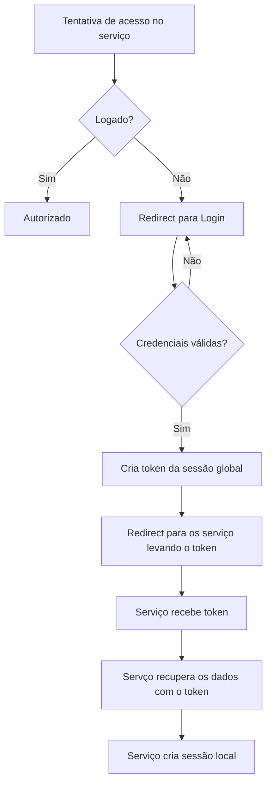

# SSO
Solução de login único

Existem 2 possiblidades:  
A) Usar um serviço de SSO pronto;  
B) Impementar um serviço próprio.

## Serviços prontos de SSO
| Serviço                       | Preço Incial               |
| ----------------------------- | -------------------------- |
| [auth0](https://auth0.com/pt) | Gratuito até 7500 usuários |

## Implementação própria
[Tutorial com a base](https://codeburst.io/building-a-simple-single-sign-on-sso-server-and-solution-from-scratch-in-node-js-ea6ee5fdf340)

### Fluxo:

Perguntas abertas:
Como fazer o controle de permissões por serviço?
Como liberar de forma prática novos serviços autenticáveis?
